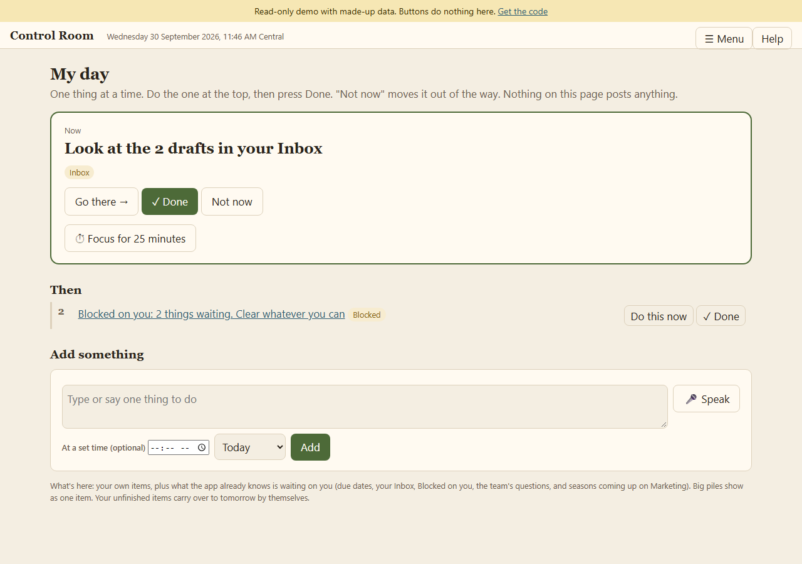

# Control Room

A small local web app for running a one-person craft shop's posting and
publishing, with AI agents doing the legwork and **you keeping the final click**.

This is a cleaned example of a real app. All shop names, posts, listings,
addresses and keys have been replaced with made-up data ("Example Woodworks").



## What it shows

- **My day**: one thing at a time, built for a focus-first brain.
- **Queue, Posts, Listings, Approvals**: the record of what is going out where.
- **Pacing**: daily ceilings per platform, so nothing gets spammed.
- **Duty**: which agent (Claude, Kimi, ChatGPT) runs the scheduled passes.
- **Requests and Team**: instructions in your own words, and questions the agents leave for you.
- **The Ward** (`app/ward/`): the door and fences. Only your browser and agents holding a key get in; agents cannot open private folders; nothing publishes without your click.

## Try it

Needs Python 3.11+.

```bash
python -m venv .venv
.venv/Scripts/activate        # Windows.  On Mac/Linux: source .venv/bin/activate
pip install -r requirements.txt
python tools/build_demo.py    # writes the made-up demo record
python -m app.server
```

Then open the launch link (it needs the key in `config/launch_key.txt`, created on first run):

```
http://127.0.0.1:8765/enter?t=<contents of config/launch_key.txt>
```

Set `CONTROL_ROOM_PORT` to use another port.

## Use your own data

The real app keeps its record in a Google Sheet (see `app/schema.py` for the tabs
and columns). To connect yours you create your own Google OAuth desktop client and
save its JSON as `config/google_client.json`. Nothing of the author's is included.
Edit `app/seed.py` to change the demo rows.

## Public read-only demo

`PUBLIC_DEMO=1` makes every page viewable and every change refused (see the
`Dockerfile`). It is meant for a hosted preview, not for real use.

## Feedback

Issues and ideas are very welcome. Useful things to say: what was confusing on
first look, what you would want a tool like this to do, and what looks unsafe.

## Licence

MIT.
